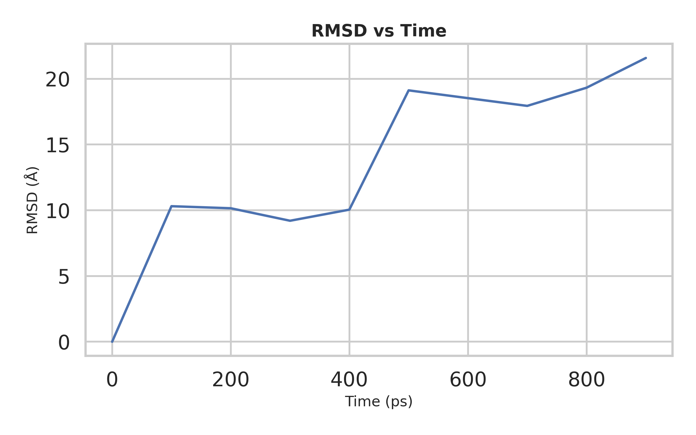
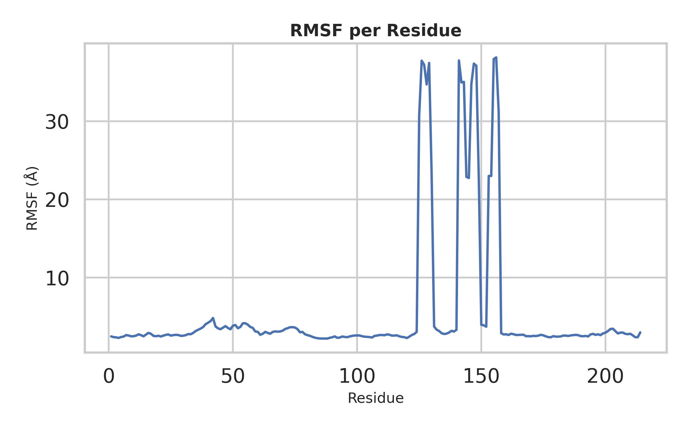
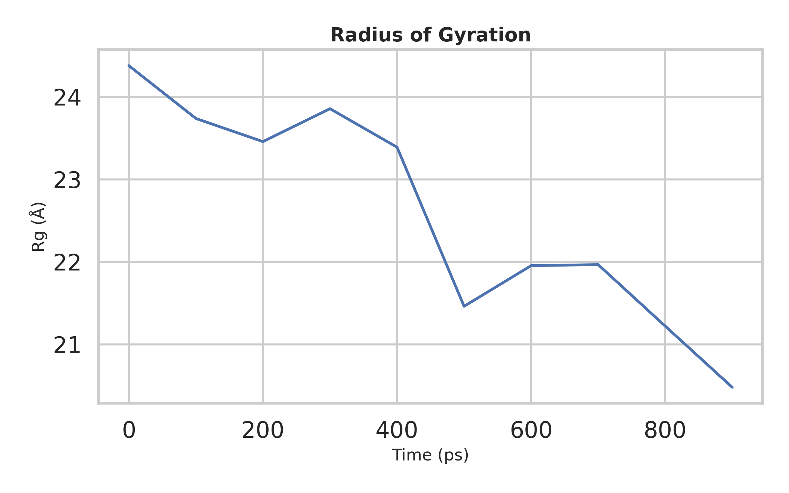
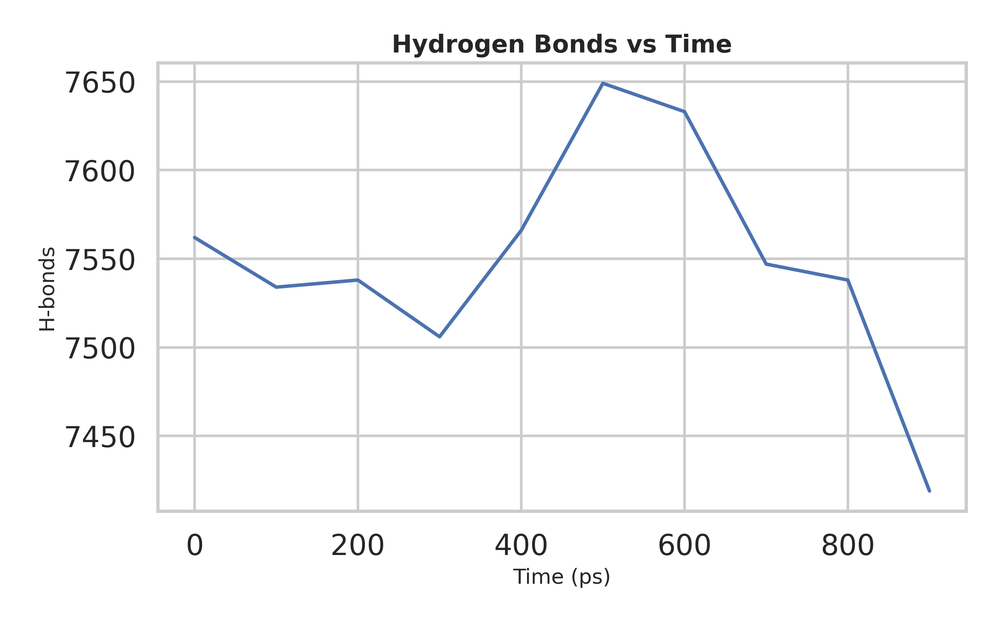
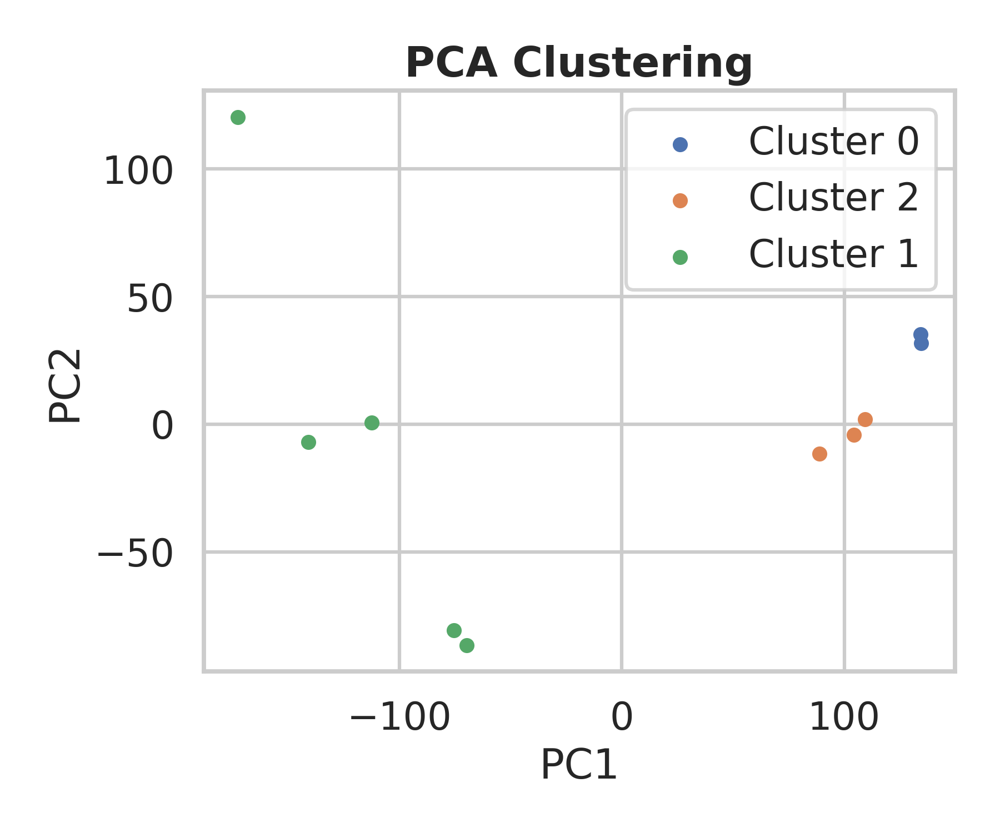

3 md_analysis_toolkit

**A Python-based toolkit for automated analysis of molecular dynamics (MD) simulations, designed for computational drug design (CADD) workflows.**

This toolkit enables fast, reproducible, and publication-ready analysis of MD trajectories using MDAnalysis.
---

git clone https://github.com/pavandeokar-git/md-analysis-toolkit.git
cd md-analysis-toolkit

python3 -m venv venv
source venv/bin/activate

pip install -r requirements.txt
---
## Usage
Run all analyses (default)
md_ana_toolkit.py

### Run specific analyses
python md_ana_toolkit.py --rmsd --pca 

### Available options
  Flag	  Description
--rmsd	  RMSD analysis
--rmsf	  RMSF analysis
--rg	  Radius of Gyration
--hbonds  Hydrogen bonds
--pca	  PCA + clustering
---
## Output
outputs/
Includes:
.csv → numerical data
.png → high-quality plots

### Example Outputs

### RMSD

  

### RMSF

  

### Radius of Gyration

  

### Hydrogen Bonds

  

### PCA Clustering

  

---
## 🧪 Test Dataset
Uses sample trajectory from:  
**MDAnalysis test dataset (Adenylate Kinase)**

---

## Author
**Pavan Deokar**  
Computational Drug Discovery Researcher  
M.S. (Pharm.) Pharmacoinformatics  
NIPER Mohali
